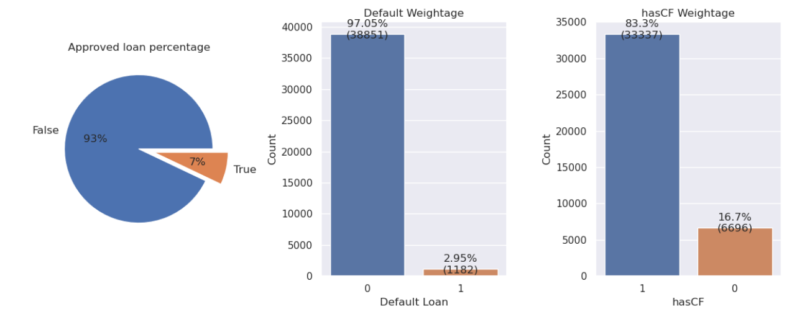

# Money Lion Project

## Intro

This is a dataset for a take-home assessment of a finance company named Moneylion. The main goal of this assessment is to develop a model that helps the company identify loans that are likely to default, thereby minimizing the risk and potential losses for the company. I’m using this dataset as a practice to showcase the business insights that I have found. Hence this report will not focus too much on the modelling aspect.

## Important Preparation

During the course of the project, I have come to realize that there is no specific column that is directly marked as a label column. However, I assume that the loan status column can serve as the key factor in determining whether a loan is classified as default or non-default. The challenge lies in the fact that the loan status column contains 21 different categories, which need to be appropriately categorized into either Default Loan or Non-Default Loan.

## Business Understanding

- Starting with the general information of the company, it can be observed that:
    - Only 7% of loan application is approved
    - Within the approved loan, only 2.95% is marked as default loan
    - Within the approved loan, 83.3% is marked as having Credit Fraud (hasCF)

**Conclusion:**
It's truly impressive how well the company excels in risk management. Despite having a high percentage of loans marked with Credit Fraud, they have managed to keep their default loan rate remarkably low. This achievement can be attributed to their stringent screening process and the company's conservative approach. Their commitment to careful evaluation and thorough risk assessment seems to be paying off, ensuring a healthy and sustainable lending portfolio.

- We will now delve into the demand for loans, as we can observe:
    - There is a significant raise in loan application count from 2014-2016 and a significant drop from 2016-2017
    - But this is not true as the dataset only provides the data starting from 3/12/2014 til 18/3/2017

**Conclusion:**
We can only confirm that there is a significant rise in the demand for loans from 2015-2016. Although there are only records for three months in 2017, the application count is nearly half of that in 2016. This indicates a sustained or potentially even higher demand for loans compared to 2016.

- After looking at the overview of the dataset, I would like to delve into the details of each year's performance. From the diagram below, we can observe that:
    - The years 2014 & 2015 have 0% of default loan
    - The year 2016 has 1.86% which is 372 cases of default loan
    - The year 2017 has 7.2% which is 810 cases of default loan

**Conclusion:**
Based on the result shown above, the company is actually not doing that well. Despite having only three months of data in 2017, the count of default loans has already surpassed that of 2016 by more than double. This serves as a clear warning to the company, indicating that if they fail to address this issue promptly, it could result in significant financial losses.

## Feature Engineering

During the feature engineering process, I employed the one-hot encoding technique to analyze the underlying significance of each categorical column. Additionally, I utilized various grouping methods, such as sum, median, minimum, and maximum, to derive new features from different columns in the payment.csv dataset.

Furthermore, I computed three additional features. The first is "time_diff," which represents the difference between the application time and origination time. This feature provides insights into the duration between applying for the loan and its origination.

The second feature, "payment_diff," captures the discrepancy between the maximum and minimum repayment amounts. This metric helps capture the variation in repayment amounts, which may indicate different borrower behaviors or financial situations.

Lastly, I calculated the "repayment_period" feature by determining the difference between the latest repayment date and the earliest repayment date. This feature provides information about the length of the repayment period, potentially highlighting patterns or trends in borrower repayment behavior.

## Modelling

Initially, I divided the data into an 80:20 ratio and applied oversampling using a random oversampler. This technique helps address class imbalance in the dataset. Next, I utilized the LightGBM model's feature importance to identify and eliminate irrelevant features. To optimize the model's performance, I employed the hyperopt library for hyperparameter tuning. However, since hyperopt uses a Bayesian optimization approach, which may not always yield the most precise results, I also manually fine-tuned the hyperparameters based on the outcomes.

The AUC result for the test set is 0.9046. The diagram below showcases the classification ability of the model. The model successfully predicted 138 out of 248 default cases correctly. However, it made the trade-off of misclassifying 561 non-default loans as default.

**Conclusion:**
Since there will always be a tradeoff between default and non-default loans, one thing that came to my mind was how many successful loans can offset the loss caused by one failed loan. However, this approach is not practical because the profitability of loans is strongly correlated with the loan amount. Therefore, it is not straightforward to simply compensate for the loss of one failed loan with the profits from other successful loans. In light of this, my model is considered more conservative as I place greater emphasis on correctly identifying default loans while sacrificing some of the accuracies.

If we would have more information on how the company wants the model to be (more aggressive/conservative), we can adjust our threshold to meet the requirement.

- Threshold=0.9: Higher accuracy but barely detect the default loans
- Threshold=0.1: Lower accuracy but almost detect all of the default loans
- Threshold=0.6: Moderate

The diagram below showcases the feature importance results for the model.

## END
